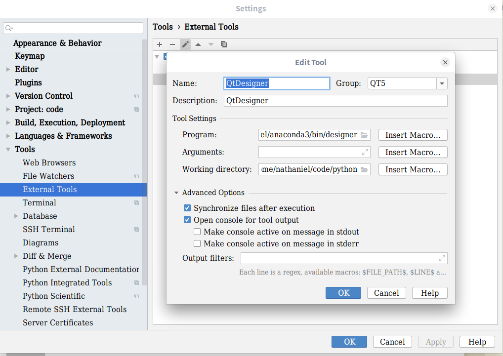
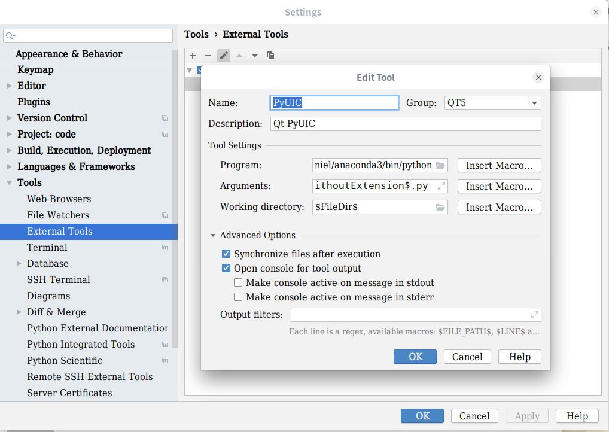
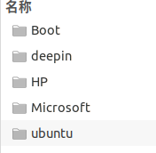
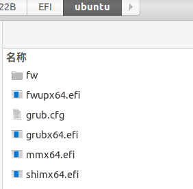
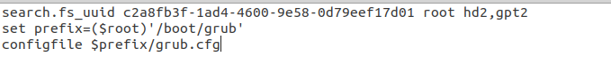

# 安装

1. 安装git
   `sudo apt-get install git`

2. 安装VsCode
   1. 下载deb包
   2. 执行如下命令
        ```
        sudo dpkg -i <file>.deb
        sudo apt-get install -f
        ```
3. 安装Popcorn Time 
   1. 下载
        ```
        $ sudo mkdir /opt/popcorn-time
        FOR 32-BIT SYSTEM EXECUTE:
        $ sudo wget -qO- https://get.popcorntime.sh/build/Popcorn-Time-0.3.10-Linux-32.tar.xz | sudo tar Jx -C /opt/popcorn-time
        FOR 64-BIT SYSTEM EXECUTE:
        $ sudo wget -qO- https://get.popcorntime.sh/build/Popcorn-Time-0.3.10-Linux-64.tar.xz | sudo tar Jx -C /opt/popcorn-time
        ```
    1. 链接
        `sudo ln -sf /opt/popcorn-time/Popcorn-Time /usr/bin/popcorn-time`
4. 安装g++
    ```
    sudo apt-get update
    sudo apt-get install g++
    ```
5. 安装mongodb
   1. [见此](https://www.jianshu.com/p/f0952b4118ec)

# 配置
1. VsCode的C++环境配置
   [见此](https://blog.csdn.net/qq_34347375/article/details/80851417)
2. PyCharm的PyQt5配置
   1. 安装PyQt5
        `conda install pyqt`
   2. 安装qtdesigner
        ` sudo apt-get install qt5-default qttools5-dev-tools`
   3. 这时，在终端输入`designer`就可以启动绘制界面了
   4. PyCharm中工具的配置
      1. QtDesigner的配置
         1. 
         2. Program 填写的内容 可在终端使用`whereis designer`查看，例：`/home/nathaniel/anaconda3/bin/designer`
         3. Working directory是工作目录
      2. PyUIC的配置
         1. 
         2. Program 是工作环境的python的位置，例：`/home/nathaniel/anaconda3/bin/python`
         3. Arguments 填写`-m PyQt5.uic.pyuic $FileName$ -o $FileNameWithoutExtension$.py `
         4. Working directory 填写 `$FileDir$`
3. 终端美化 zsh + oh-my-zsh + 
   1. 安装anaconda后出现`sh: command not find:conda`问题
      1. `vim ~/.zshrc`
      2. 在末尾添加`export PATH=/home/<username>/<anaconda>/bin:$PATH`，例`export PATH=/home/nathaniel/anaconda3/bin:$PATH`
         1. 其中<username>是自己主目录的名字，即用户名
         2. <anaconda>是anaconda安装目录的名字，我电脑上就是anaconda3
      3. 应用配置`source ~/.zshrc`
# 一些命令
1. 解压
   `
## grub引导问题捣腾记录
1. 我在安装Ubuntu时，是安装在一个SSD中的，但是没有boot分区，引导安装在了windows的EFI中。
2. 如果想要换机，就需要在新的电脑中添加引导文件，故此记录一下如何操作
   1. 我通过DiskGenie将原电脑EFi分区中的Ubuntu文件夹拷贝至新电脑的EFI中  <br />   
   2. 通过EasyUEFI软件添加新的引导
   3. 重启选择Ubuntu启动，这时会进入grub界面
   4. 按以下命令依次操作
      1. `ls`   会列出一系列诸如`(hd0), (hd0,msdos1)`之类的磁盘分区，以A代表其中一个。
      2. `ls A/boot/grub` 按照1步的结果，替换A执行此命令，直到结果中含有`grub.cfg`。 一般来说`ls (hd0, msdos1)/boot/grub`会出现`grub.cfg`
      3. `set = root=(hd0, msdos1)` 
      4.  `set  prefix=(hd0, msdos1)/boot/grub`
      5.  `normal`
      6.  这时应该就进入了Ubuntu的引导界面
      7.  进入Ubuntu后，打开终端
      8. `sudo update-grub`
      9. `sudo grub-install /dev/sda` 分区为Ubuntu安装的分区，而且只可以不可以指定分区号`/dev/sda1`
      10. 理论上这样就可以了
   5.  但是！我的电脑重启后，又进入了grub界面，重新执行第4步后又可以进入Ubuntu系统了。
   6.  在`EFI/ubuntu`文件夹中，打开`grub.cfg`文件，发现其中有root和prefix变量，故而我猜测每次重启后root和prefix的值都发生了变化，所以需要每次重新设置临时的值。
   7. 所以我直接**替换了 `grub.cfg`文件中root变量的值为一常量**, 即**将$root替换成(hd0, msdos1)**（因为prefix的值是根据root的值得来的故而不需要修改, 另**这个值要看第3步找到的root的值**），这样就大功告成了！重启后进入了Ubuntu的引导界面。<br />     
3. 直接修改grub的方法，应该可以本机上顺利运行下去，但是换机的话还是要重新更改。


# 一些杂乱的问题
1. 权限问题
   若无写入文件失败，应修改文件夹/文件权限

    ```
    chmod 777 -R  需要改变存取模式的目录
    ```
    sudo chmod 600 ××× （只有所有者有读和写的权限）
    sudo chmod 644 ××× （所有者有读和写的权限，组用户只有读的权限）
    sudo chmod 700 ××× （只有所有者有读和写以及执行的权限）
    sudo chmod 666 ××× （每个人都有读和写的权限）
    sudo chmod 777 ××× （每个人都有读和写以及执行的权限）

2. github访问慢
   1. 打开hosts文件
   `sudo vim /etc/hosts`
   1. 添加以下内容
        ```
        192.30.253.113  github.com
        151.101.25.194 github.global.ssl.fastly.net
        192.30.253.121 codeload.github.com
        ```
    1. 保存并退出，重启网络服务
        `sudo /etc/init.d/networking restart`

3. 播放音乐杂音问题
   1. 终端 `alsamixer
   2. ` 进入声卡设置
   3. 按F6，选择HDA Intel PCH
   4. 将所有有红色的调至没有红色
   5. 感觉这样好了些，但没有完全消除

4. 开机进入BusyBox界面(initramfs)
   1. 输入`exit`，观察显示的英文，是哪个地方出现了error,例如：`/dev/sdc2`
   2. 输入`fsck -y /dev/sdc2`,等待
   3. 输入`exit`，进入桌面系统

5. apt死锁问题
   1. `sudo rm /var/lib/dpkg/lock`

6. 不可以访问exfat格式U盘的问题
   1. `sudo apt-get install exfat-utils`
   2. 重启即可，有可能不用重启

7. Ubuntu死机的解决方法
   1. 一般死机都是在tty2，这是`ctrl+alt+F3`切换到tty3
   2. 输入用户名、密码登录
   3. 输入`top`命令，找到占用最高的进程（一般都是占用cpu最高的进程导致死机），记住其前面的id
   4. `kill <id>`

8. Ubuntu添加应用图标的方法
   1. 以xMind为例
   2. `cd /usr/share/applications`
   3. `sudo vim xmind.desktop`
   4. 键入以下内容 
        ``` 
        [Desktop Entry]
            Name=XMind8
            Comment=XMind8
            Exec=/home/nathaniel/tools/ubuntu/xmind-8-update8-linux/XMind_amd64/./XMind
            Icon=/home/nathaniel/tools/ubuntu/xmind-8-update8-linux/icon.png
            Path=/home/nathaniel/tools/ubuntu/xmind-8-update8-linux/XMind_amd64
            Terminal=false
            Type=Application
            StartupNotify=true
            Categories=Network;Development;
        ```
    5. `Exec`是启动文件的路径；`Icon`是图标的路径
