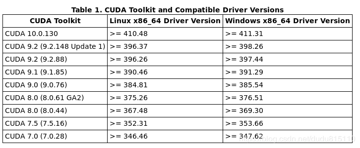
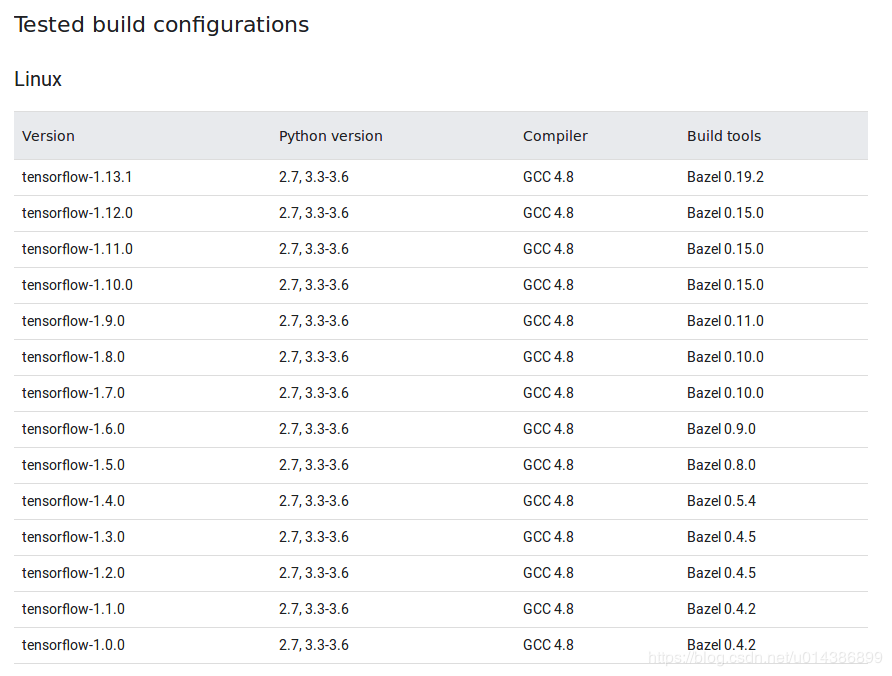
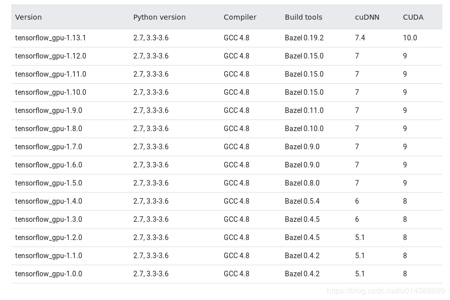
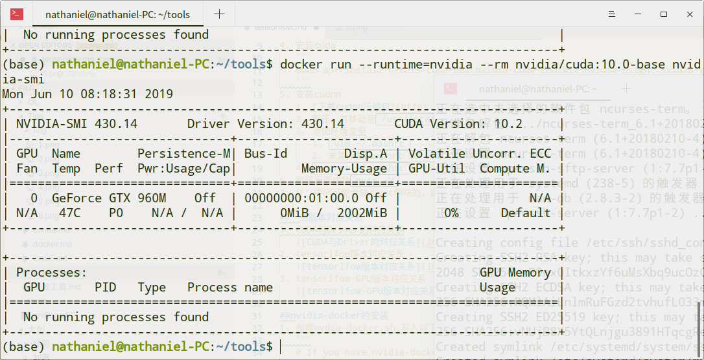
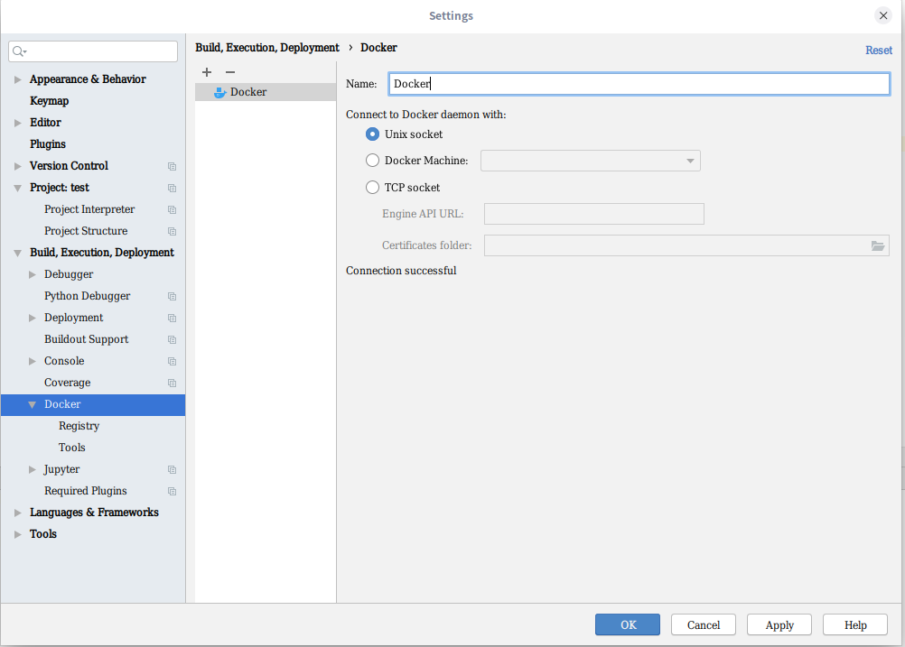
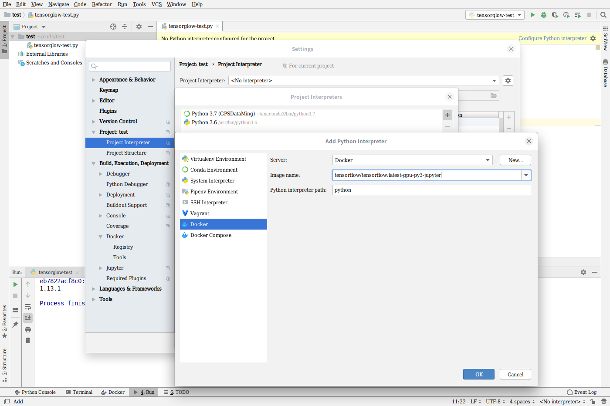
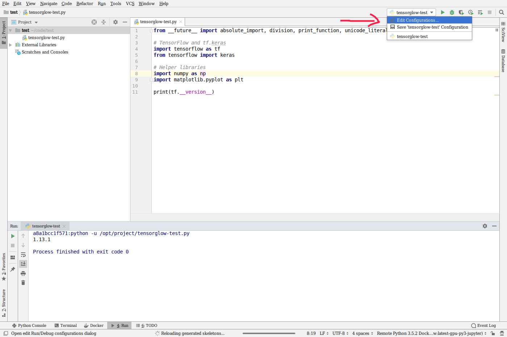
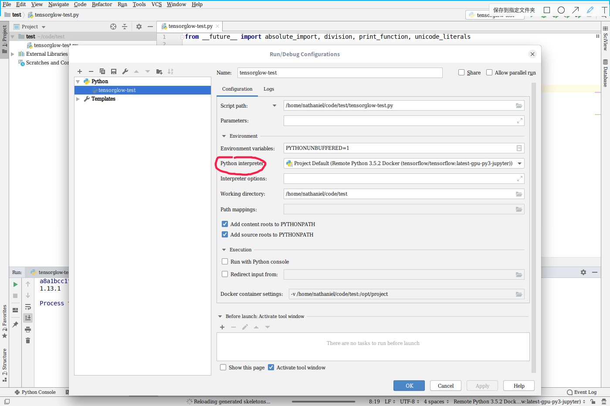

# tensorflow-GPU环境的配置
1. 安装nvida显卡驱动
   ```
   sudo apt update
   sudo apt install nvidia-smi nvidia-driver
   ```
2. 重启
3. 终端输入`nvidia-smi 或 sudo optirun nvidia-smi`，有显示安装成功
4. 安装cuda
   ```
   sudo apt install nvidia-cuda-dev nvidia-cuda-toolkit nvidia-nsight nvidia-visual-profiler
   ```
5. 安装cudnn
   1. [下载cudnn压缩包](https://developer.nvidia.com/search/site/cudnn-7.0-linux-x64-v4.0)
   2. 解压，并移动至`/usr/local/`（可能会有权限问题，注意一哈）
   3. 添加环境变量
      1. `vim ~/.bashrc`
      2. 末尾添加`export LD_LIBRARY_PATH="/usr/local/cuda/lib64:$LD_LIBRARY_PATH"`
   4. `source ~/.bashrc`
6. 验证是否成功`nvcc -V`
7. 注：中间可能会缺少gcc啊啥的，这就不说了

## 一些版本对应关系
1. CUDA与Driver的对应关系
   
2. tensorlfow版本对应关系
   
3. tensorlfow-GPU版本对应关系
   

## nvidia-docker的安装
1. 创建 `nvdia-docker.sh`,写入以下内容（`distribution`按照自己的系统填写,终端运行`. /etc/os-release;echo $ID$VERSION_ID`即可查看），并运行.
   
   ```
   # If you have nvidia-docker 1.0 installed: we need to remove it and all existing GPU containers
   docker volume ls -q -f driver=nvidia-docker | xargs -r -I{} -n1 docker ps -q -a -f volume={} | xargs -r docker rm -f
   sudo apt-get purge -y nvidia-docker

   # Add the package repositories
   curl -s -L https://nvidia.github.io/nvidia-docker/gpgkey | \
   sudo apt-key add -
   distribution="debian9"
   curl -s -L https://nvidia.github.io/nvidia-docker/$distribution/nvidia-docker.list | \
   sudo tee /etc/apt/sources.list.d/nvidia-docker.list
   sudo apt-get update

   # Install nvidia-docker2 and reload the Docker daemon configuration
   sudo apt-get install -y nvidia-docker2
   sudo pkill -SIGHUP dockerd
   ```
2. 运行`docker run --runtime=nvidia --rm nvidia/cuda:10.0-base nvidia-smi`,如下图则成功
   
## 一些使用方法

### 拉取tensorflow镜像
1. `nvidia-docker run -it -p 8888:8888 tensorflow/tensorflow:latest-gpu-py3-jupyter`
2. 映射到了本地的8888端口，浏览器访问`localhost:8888`之后，输入token（在1中命令输出的里面找），即可进入jupyter

### 挂载本地目录
1. `nvidia-docker run -it -v /home/nathaniel/code/test:/tf/notebook -p 8888:8888 tensorflow/tensorflow:latest-gpu-py3-jupyter`
2. 好像容器目录必须在`/tf`内

### 终端使用docker
1. `nvidia-docker run -it -v /home/nathaniel/code/test:/tf/notebook -p 8888:8888 tensorflow/tensorflow:latest-gpu-py3-jupyter bash`


## pycharm的docker配置
1. docker配置
   
2. python解释器配置，选择对应的镜像
   
3. 为当前项目，选择对应的解释器
   
   
4. 修改`/etc/docker/daemon.json`文件，使pycharm使用nvidia-docker来运行tensorlfow镜像，即添加`"default-runtime": "nvidia"`
   ```
   {
    "default-runtime": "nvidia",	
    "runtimes": {
        "nvidia": {
            "path": "nvidia-container-runtime",
            "runtimeArgs": []
        }
    }
   }
   ```
5. 重启docker守护进程`sudo pkill -SIGHUP dockerd`
6. 大功告成
   
## docker下无法使用http代理的问题（这方法有问题）
1. 问题即在docker的bash中，使用`export http_proxy="http://127.0.0.1:12333" export https_proxy="http://127.0.0.1:12333"`无法走ssr代理
2. 解决方案
   1. `sudo vim /etc/default/docker`
   2. 添加`export http_proxy="http://127.0.0.1:12333" export https_proxy="http://127.0.0.1:12333"`
   3. 重启docker`sudo service docker restart`
3. 

